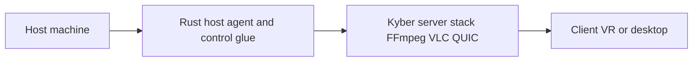

# Plan: Kyber virtual desktop (kyber-vr)

## Problem statement

Build **virtual-desktop-style software** that uses **[Kyber](https://kyber.media/)** end-to-end so that **glass-to-glass and input-to-display latency stay as low as the stack allows**, rather than re-implementing a separate streaming or remote-desktop protocol (RDP, classic WebRTC, etc.).

**Primary success metric:** end-to-end latency (including capture, encode, network, decode, and display) **dominated by Kyber’s design choices** (QUIC, minimal buffering, control-focused paths), with explicit measurement and iteration.

**Alignment with this repository:** the [README](README.md) describes software to play **VR games using** Kyber technology. The core streaming and control work should follow **official Kyber client/server and protocol components**; VR-specific work layers on top once the baseline path is sound.

## Non-goals (initial phase)

- **Feature parity** with legacy enterprise remote desktop (e.g. full multi-monitor policy, every peripheral edge case) before the latency-critical path is proven.
- **A second custom transport** alongside Kyber for the same bitstream, unless a clear upstream or operational requirement appears later.

## What “Kyber” means here (disambiguation)

**Not** the lattice cryptography KEM also named “Kyber.”

**Here:** the VideoLAN / VLC ecosystem’s **real-time, low-latency control streaming** work: **video, audio, control inputs, and telemetry** over **QUIC/HTTP3**, with **forward error correction** and a product focus on **control latency** (remote desktop, cloud gaming, robots, **immersive / XR**), per [kyber.media](https://kyber.media/) and the **[Kyber](https://gitlab.com/kyber)** group on GitLab (subgroups such as `core`, `apps`, and `deps`). A separate public group, **[`kyber.stream`](https://gitlab.com/kyber.stream)**, also exists; **which namespace and repos you integrate with** depend on upstream access and documentation—treat the GitLab **group UI** as the map, and **pin** a concrete project with evidence.

**Implication:** the project **orchestrates** the host, client, and network path through **Kyber’s stack** (encoder/decoder, protocol, input path) instead of building a greenfield RDP/RTSP-style stack from scratch.

## Language choice: **Rust (primary)**

### Decision

**Primary language: Rust.** Use **C/C++ only as consumed** through Kyber, FFmpeg, VLC, and other upstream binaries/libraries—not as the default language for this application’s own code—unless a released Kyber integration **only** exposes a surface that makes another language the pragmatic host (then reassess with evidence).

### Rationale (summary)

| Area | Rust fit | Notes |
|------|----------|--------|
| **Alignment with Kyber** | **Strong** | Public materials (e.g. coverage of Kyber from the VideoLAN side) describe **input and control** handled by a **dedicated server written in Rust** (keyboard, mouse, gamepad, clipboard, file transfer, USB-style paths). That supports treating Rust as **first-class** in the same ecosystem, not a bolt-on. |
| **Low-latency engineering** | **Strong** | Predictable performance, no GC pauses, strong **async I/O** fit for QUIC-style transports, and a good place for **tight scheduling** at the edges: capture, input injection, and framing metadata. |
| **Media (FFmpeg / VLC)** | **Via SDK / FFI** | Core A/V remains in **FFmpeg + VLC (C/C++)** inside Kyber. This repo should **use** those paths through Kyber; **FFI and `unsafe` boundaries** are acceptable at the SDK edge. |
| **Virtual desktop + VR** | **Platform APIs + Kyber** | Capture and input injection are **OS- and device-specific** (Windows, macOS, Linux; **Quest / Vision** appear on the official site). Rust is **usable** for the agent/glue, but each platform must be wired to the right APIs and then fed into Kyber’s pipeline. **Confirm client shape** (native, WebTransport in browser, vendor tooling) against upstream projects under [gitlab.com/kyber](https://gitlab.com/kyber) (and any mirror or related group you rely on) as they are adopted. |

**Bottom line:** Rust is **technically appropriate** and **strategically aligned** with public descriptions of Kyber’s control path. **Latency is end-to-end:** Rust helps at the **edges and orchestration**; the **bottleneck** is often **display, encoder, and network**—still, **delegate media to Kyber/FFmpeg/VLC** and optimize the full path.

## Architecture (high level)

- **Host:** OS, GPU, and capture/injection hooks.
- **Rust glue:** session lifecycle, device integration, and any custom logic that stays **out** of the codec core but **in** the latency path (ordering, policy, telemetry).
- **Kyber stack:** encoders/decoders, protocol, and shared clock semantics as provided upstream.

## Integration milestones

1. **Bootstrap upstream:** clone/build/run the **smallest public sample** from the Kyber **GitLab** tree (e.g. `core` / `apps` under [`gitlab.com/kyber`](https://gitlab.com/kyber)), following upstream docs and licenses.
2. **Virtual desktop path:** replace or wrap the demo with **your** capture and input path while keeping the **same Kyber pipeline** (no parallel protocol for the same use case in v1).
3. **Measure:** define a repeatable **glass-to-glass** (or camera-based) method and, where applicable, **input-to-photon** notes; log encoder settings, frame pacing, and network conditions.
4. **VR:** add headset-specific constraints and client packaging **after** the flat **host → client** Kyber path is stable, using whatever client targets upstream documents for **Quest** / **Vision** class devices.

## Risks and open items

- **Licensing:** Kyber is described as **AGPL** with **commercial** options; [kyber.media](https://kyber.media/) and upstream repos govern **compliance** for distribution and modification—validate before shipping binaries.
- **Binding surface (Rust vs C vs other):** the **public** integration surface (Rust crates, C headers, or mixed) must be **verified against the specific repositories** you depend on. Do not assume a C ABI only, or only Rust, until the chosen project’s build and API docs say so. See [Upstream integration notes](#upstream-integration-notes) below.
- **Quest / Vision pipeline:** “Universal” on [kyber.media](https://kyber.media/) is a **product** claim; **build and runtime** details come from the repos you track—treat as **TBD** until locked in a milestone.

## Upstream integration notes (SDK binding)

When you pin to concrete Kyber subprojects (for example under **[`gitlab.com/kyber`](https://gitlab.com/kyber): `core`**, **`apps`**, **`deps`**,** or a sibling group such as [`kyber.stream`](https://gitlab.com/kyber.stream)**):

- **Read** that project’s `README`, build scripts, and package layout for **API language** (Rust library crate vs C ABI for `bindgen` / `cc` / `pkg-config`).
- **If Rust API:** use workspace dependencies as upstream documents; keep FFI **internal** to Kyber.
- **If C API only:** use **`bindgen`** (or the upstream’s own `-sys` crate if provided) and restrict **`unsafe`** to a thin, reviewed layer.
- **If mixed:** one module per concern (protocol vs capture vs input) to avoid leaking abstraction levels.

**Status:** the **public** group and subgroup pages (e.g. `kyber` → `core` / `apps` / `deps`) show **where to look** even when project listing APIs are unhelpful. Unauthenticated `GET /groups/:id/projects` style **project** listings can return an **empty** set for **access-restricted** or non-enumerated repositories; that does **not** prove the tree is empty. Use **clone access** to a chosen repository and its **README** for the true binding surface. **Update this section** when a specific project is selected and its exports are known.

**Related (VideoLAN, not a full Kyber SDK substitute):** public forks or branches of **FFmpeg** on VideoLAN’s GitLab (e.g. a **`kyber` branch** under community work such as [rom1v/ffmpeg@kyber on code.videolan.org](https://code.videolan.org/rom1v/ffmpeg/-/tree/kyber)) can inform **FFmpeg-side** work only—**not** a replacement for the complete Kyber **client, protocol, and input** stack unless you explicitly depend on that path.

## Research references (public)

Auditable basis for the language and stack discussion:

- [Kyber — official site](https://kyber.media/) — positioning, use cases (remote desktop, immersive), QUIC, FEC, platforms.
- [Kyber — GitLab group](https://gitlab.com/kyber) — `core`, `apps`, `deps` (and similar); primary map for this plan.
- [Kyber — GitLab group `kyber.stream`](https://gitlab.com/kyber.stream) — additional public group; see disambiguation above.
- [GIGAZINE — Kyber and VideoLAN](https://gigazine.net/gsc_news/en/20250804-vlc-kyber/) — secondary; mentions Rust for input handling, FFmpeg/VLC, QUIC, RaptorQ-style FEC in interviews.
- [Streaming Learning Center — interview with Jean-Baptiste Kempf of Kyber](https://streaminglearningcenter.com/articles/an-interview-with-jean-baptiste-kempf-of-kyber.html) — secondary; AGPL and dual licensing, glass-to-glass / control framing (**vendor claims**; not a product SLA for this repo).
- [YouTube — Jean-Baptiste Kempf: Kyber, QUIC, real-time video and control streaming](https://www.youtube.com/watch?v=0RvosCplkCc) — technical overview; use as a cite, not a substitute for reading source.

**Treat all press and interview figures as secondary** to **upstream source** and your own **measurements** for implementation truth.

## Links

- [https://kyber.media/](https://kyber.media/)
- [https://gitlab.com/kyber](https://gitlab.com/kyber) (canonical for subgroups `core` / `apps` / `deps` in this plan)
- [https://gitlab.com/kyber.stream](https://gitlab.com/kyber.stream) (related GitLab group)
